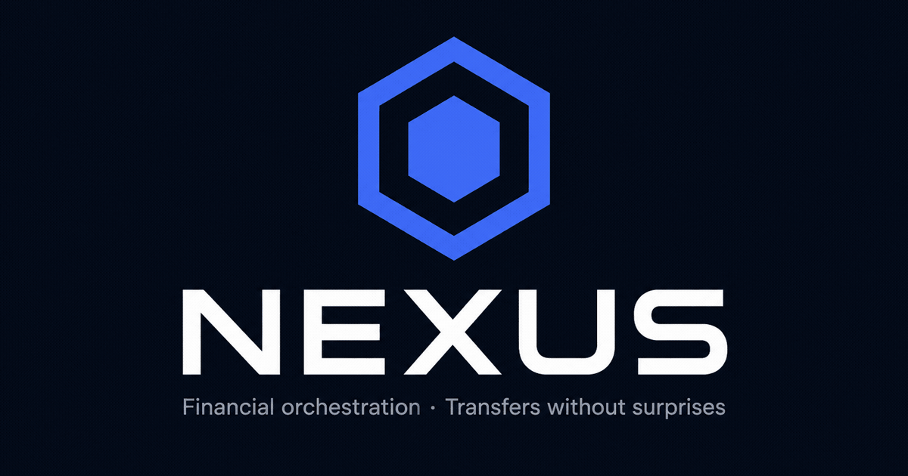
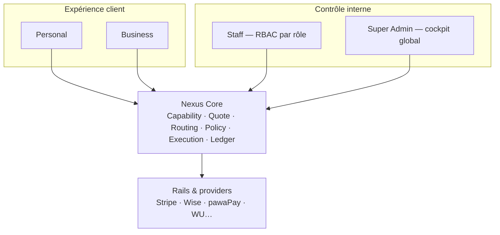

<div align="center">

# Nexus Technologies

**Orchestration financière multi-providers — l’intention utilisateur devient la route optimale.**

[](nexus-api/)
[](nexus-frontend/)
[](nexus-frontend/)
[](nexus-frontend/)
[](nexus-api/database/)
[](LICENSE)

<br />



<br />

[Vision](#-vision) ·
[Surfaces](#-surfaces) ·
[Nexus Core](#-nexus-core) ·
[Fonctionnalités](#-fonctionnalités) ·
[Stack](#-stack-technique) ·
[Démarrage rapide](#-démarrage-rapide) ·
[Documentation](#-documentation)

</div>

---

## Vision

**Nexus** n’est ni une banque, ni un simple wallet, ni un PSP. C’est la **couche d’orchestration** au-dessus des rails de paiement : l’utilisateur exprime une *intention* et une **préférence de routage**, Nexus calcule puis exécute la **meilleure route** disponible — sans exposer providers ni mécanismes internes.

```text
USER INTENT  →  NEXUS INTELLIGENCE  →  OPTIMAL ROUTE  →  EXECUTION  →  SETTLEMENT  →  LEDGER
```

> **Nexus Pro n’existe plus.** Offre officielle : **Personal**, **Business** et **Connect** (API B2B) autour d’un **Nexus Core** unique. Le **Super Admin** et le **portail Staff** forment le centre de contrôle interne.

### Produit en un coup d’œil

| Surface | Public | Rôle |
|--------|--------|------|
| **Personal** | Clients particuliers | Envoi, réception, conversion, wallet multi-devises |
| **Business** | Entreprises | Trésorerie, paiements, équipe, rapprochement, approbations |
| **Connect** | Partenaires B2B | API d’orchestration (conceptuel / roadmap) |
| **Staff** | Opérateurs internes | Consoles par département (Compliance, Support, Trésorerie…) |
| **Super Admin** | Direction / ops | Cockpit global, dossiers clients, audit, providers |

---

## Surfaces



| Portail | URL | Accès |
|---------|-----|-------|
| Client | `/login` → `/dashboard` | Comptes `user` (personal / business) |
| Staff | `/staff-login` → `/staff` | Rôles internes (`compliance_officer`, `customer_support`, …) |
| Super Admin | `/admin-login` → `/admin` | `superadmin` uniquement |

Les **portails d’auth sont séparés** : un token staff ne peut pas accéder aux surfaces client, et inversement — contrôles côté API + tests d’isolation.

---

## Nexus Core

| Moteur | Rôle |
|--------|------|
| **Capability Engine** | Corridors, pays, devises, modes réellement disponibles |
| **Quote Engine** | Devis comparables — taux, frais, spread, ETA |
| **Routing Engine** | Route `SOURCE → RAILS → DESTINATION` selon la préférence : Optimisé · Rapide · Moins cher · Max reçu · Fiabilité |
| **Policy Engine** | KYC/AML, plafonds, sanctions, conformité |
| **Funding Source Engine** | Wallet réel ou origine provider vérifiée |
| **Execution Engine** | Saga multi-étapes, idempotence, rollback, débit wallet |
| **Self-Healing** | Re-routing automatique sur route alternative |
| **Ledger** | Double entrée, holds, capture, réconciliation, audit |

---

## Fonctionnalités

### Client — Personal & Business

- **Envoi / Réception / Conversion** multi-devises (EUR, USD, XAF, …)
- **Préférence de routage** — l’utilisateur choisit l’objectif, Nexus choisit la route
- Wallet multi-devises : disponible · en attente · en transit · settlement
- Historique, notifications, KYC, agents, cartes
- **Support chat** — assistant **Fin** (pré-ticket), escalade agent humain, pièces jointes, badge non-lu
- **Business** : bénéficiaires, paiements, équipe, rapprochement, approbations

### Super Admin — centre de contrôle

- **Cockpit temps réel** (Recharts) alimenté par l’API admin
- **13 sections** : comptes, transactions, opérations, trésorerie, compliance, risque, providers, support, sécurité, technique, audit, employés, paramètres
- **Dossier client** — modal professionnel (Identité · Soldes · Moyens · Journal) avec actions fintech : copie ID, contact, navigation Compliance/Transactions/Support/Audit, suspendre / réactiver / clôturer
- **Exports PDF** — dossier client complet et relevé de transactions (jsPDF)
- Vue providers : catalogue, statuts, credentials chiffrées (jamais exposées en clair)

### Staff — opérations par rôle

- Consoles dédiées par département (Compliance, Support, Trésorerie, Risque, Providers, Sécurité, Technique…)
- **RBAC strict** côté backend — 20+ rôles plateforme catalogués
- Isolation client / opérateur testée (PHPUnit + parcours frontend)

### Providers (catalogue)

Stripe · pawaPay · Wise · Nium · Currencycloud · Thunes · Modulr · Swan · BVNK · Orange Money · MTN MoMo · M-Pesa · dLocal · Ebanx · Xendit · Marqeta · **Western Union** (Mass Payments, mTLS)…

> L’accès production nécessite un onboarding partenaire. Configuration via variables d’environnement — jamais de secrets dans le code.

### Pages publiques

Landing premium (Framer Motion + GSAP), auth, inscription profil riche, reset mot de passe réel, pages légales avec TOC sticky, documentation API.

---

## Stack technique

<table>
<tr>
<td align="center" width="50%">

**Frontend** `nexus-frontend/`

React 19 · Vite 8 · TypeScript  
React Router 7 · Recharts · Zustand  
Framer Motion · GSAP  
Thème fintech sombre (Revolut/Wise)  
7 langues · `safeStorage` cross-navigateur

</td>
<td align="center" width="50%">

**Backend** `nexus-api/`

PHP 8.1+ · PDO · MySQL/MariaDB  
API REST `/api` · JWT · rate-limiting  
RBAC serveur · migrations versionnées  
Ledger double entrée · holds/capture  
Providers chiffrés AES-256-GCM  
PHPUnit · fail-closed en production

</td>
</tr>
</table>

### Architecture du dépôt

```text
nexus-technologies/
├── nexus-frontend/     React 19 + Vite — Personal, Business, Staff, Super Admin
├── nexus-api/          PHP 8 — API REST, ledger, providers, RBAC
├── agents/             Agents Node/Express (conceptuel — compliance, routing)
├── docs/               Vision, audits, specs providers
├── README.dev.md       Guide développeur détaillé (ports, routes, seeds)
└── LICENSE             Apache 2.0
```

---

## Démarrage rapide

### Prérequis

Node.js ≥ 18 · PHP 8.1+ (`pdo_mysql`, `bcmath`, `mbstring`, `openssl`) · MySQL/MariaDB

### 1 · Backend

```bash
cd nexus-api
composer install
cp .env.example .env          # adapter DB_USER / DB_PASS
bash database/migrate.sh      # schéma + migrations
php -S 0.0.0.0:8080 -t public public/router.php
```

Health check : `curl http://localhost:8080/api/health`

Tests : `DB_USER=nexus DB_PASS=nexus_dev_pw php scripts/setup_test_db.php && php vendor/bin/phpunit`

### 2 · Frontend

```bash
cd nexus-frontend
npm install
npm run dev
```

→ [http://localhost:5173](http://localhost:5173) (proxy `/api` → `:8080`)

### 3 · Comptes de démo

Seed : `php scripts/seed_dev_data.php` (mot de passe `password123`)

| Email | Rôle | Destination |
|-------|------|-------------|
| `admin@nexus-tech.io` | Super Admin | `/admin` |
| `business@example.com` | Client Business | `/dashboard` |
| `test@example.com` | Compliance Officer | `/staff` |

> En dev sans `.env`, les défauts XAMPP (`config/env.php`) suffisent. Voir [README.dev.md](README.dev.md) pour ports, routes API, sandbox vs fonds réels.

---

## Documentation

| Document | Contenu |
|----------|---------|
| [docs/NEXUS-VISION.md](docs/NEXUS-VISION.md) | **Vision globale v6 — source de vérité** |
| [README.dev.md](README.dev.md) | Setup dev, routes API, providers, i18n, seeds |
| [docs/NEXUS-PROVIDER-CONFIG.md](docs/NEXUS-PROVIDER-CONFIG.md) | Configuration providers & credentials |
| [docs/NEXUS-PROVIDERS.md](docs/NEXUS-PROVIDERS.md) | Catalogue et capacités |
| [docs/NEXUS-SECURITY-AUDIT.md](docs/NEXUS-SECURITY-AUDIT.md) | Audit sécurité |
| [docs/NEXUS-TECHNOLOGIES.md](docs/NEXUS-TECHNOLOGIES.md) | Spec produit v5.3 *(archivée)* |

---

## Statut

**Phase 1–3 — Foundation + MVP Financial Orchestration**

| Domaine | État |
|---------|------|
| Wallets multi-devises & ledger | ✅ |
| Engines Capability / Quote / Routing / Policy / Execution | ✅ |
| Send · Receive · Convert + préférences de routage | ✅ |
| Self-healing & corridor EUR → XAF | ✅ |
| Super Admin cockpit + dossiers clients PDF | ✅ |
| Staff RBAC + isolation identités | ✅ |
| Support chat (Fin) + escalade agent | ✅ |
| Providers catalogue + Western Union | ✅ |
| Pages légales & auth robuste | ✅ |
| Intégrations providers production | 🔜 onboarding partenaires |

---

<div align="center">

**Nexus Corp Technologies** — août 2026

[⬆ Retour en haut](#nexus-technologies)

</div>
